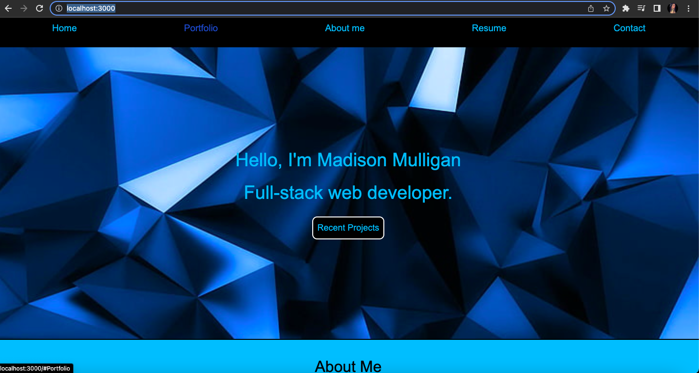

# Madison Mulligan Portfolio
 
 ## Links
 -[Repo](https://github.com/maddyrae9/react-portfolio)
 -[Live](https://maddyrae9.github.io/react-portfolio/)

 ## Description
 A professional web portfolio using REACT to allow managers to view my recent projects 

 ## Instructions
 Clone the repo. Run 'npm start' and visit (http://localhost:3000/)

 ## Contact Me
 * -[Email](madisonmulligan97@gmail.com)
 * -[LinkedIn](https://www.linkedin.com/in/madison-mulligan-a7b1651b5/)
 * -[Github](https://github.com/maddyrae9)

 ## Screenshot
